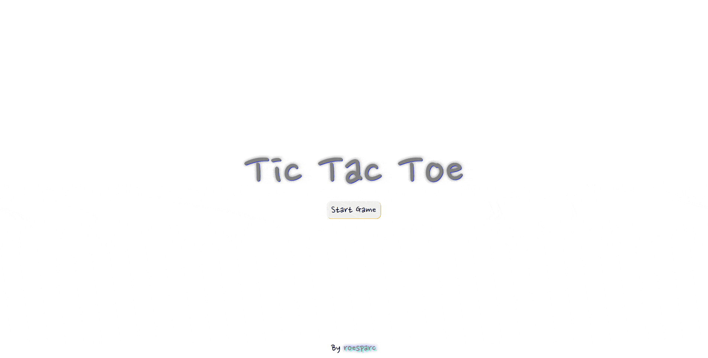

# Tic Tac Toe

## [Live Demo](https://roesparc.github.io/Tic-Tac-Toe/)

### Vanilla JS Tic Tac Toe project

The core purpose of this project is to make use of factory functions and modules to reduce the JavaScript global code as much as possible and use private scopes instead.

### Features

- Two players mode
- Player VS bot mode
- Three difficulties for the bot mode (easy, medium and impossible)
- The impossible level uses the minimax algorithm for the bot (personalized code)
